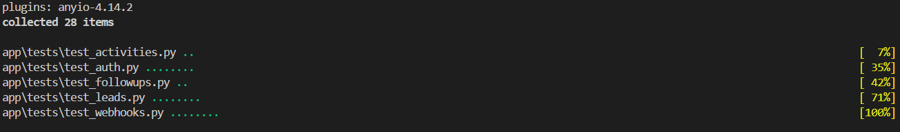
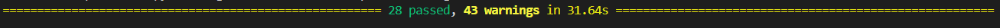
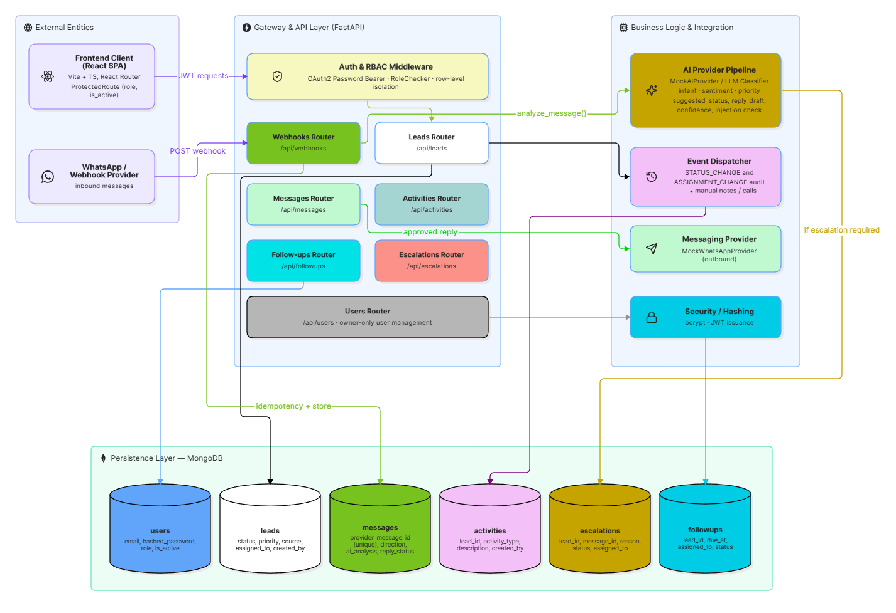

## Introduction

This project is a role-based Customer Relationship Management (CRM) system designed to streamline lead management, communication, follow-ups, and escalation workflows. The system provides a centralized platform for managing leads and user activities while supporting role-based access for Owners, Sales Managers, and Sales Executives.

The application follows a decoupled architecture with a React, Vite, and TypeScript frontend and a FastAPI backend, with MongoDB used for data persistence. It integrates an asynchronous-ready message ingestion pipeline, AI-assisted message classification, automated escalation handling, and an activity-based audit trail to improve operational efficiency and maintain traceability.

The system is designed with scalability, security, and maintainability in mind. Authentication and role-based authorization protect application resources, while structured API layers, service abstractions, database indexing, and modular frontend features provide a foundation for extending the system as the number of leads and users grows.

This README documents the system architecture, high-level design, data flows, project structure, setup process, test results, scalability considerations, known limitations, and planned future improvements.

### File Tree Structures

#### Frontend

```
frontend/
├── public/
├── src/
│   ├── assets/
│   ├── components/
│   │   ├── ui/
│   │   └── form/
│   ├── config/
│   ├── context/
│   ├── features/
│   │   ├── auth/
│   │   ├── leads/
│   │   ├── dashboard/
│   │   ├── follow-ups/
│   │   └── escalations/
│   ├── hooks/
│   ├── layouts/
│   ├── pages/
│   ├── routes/
│   ├── services/
│   ├── types/
│   ├── utils/
│   ├── App.tsx
│   └── main.tsx
├── .env
├── index.html
├── package.json
├── tsconfig.json
└── vite.config.ts

```

#### Backend

```
backend/
├── app/
│ ├── main.py
│ ├── api/
│ │ ├── auth.py
│ │ ├── users.py
│ │ ├── leads.py
│ │ ├── activities.py
│ │ ├── followups.py
│ │ ├── escalations.py
│ │ └── webhooks.py
│ ├── core/
│ │ ├── config.py
│ │ ├── security.py
│ │ ├── permissions.py
│ │ └── exceptions.py
│ ├── schemas/
│ ├── services/
│ ├── repositories/
│ ├── integrations/
│ │ ├── ai_provider.py
│ │ └── messaging_provider.py
│ └── tests/


```

---

### Setup Instructions

#### Prerequisites

- Node.js v18+ and Python 3.11+.
- An active MongoDB cluster (MongoDB Atlas recommended for production parity).

#### Backend Setup (FastAPI)

- Navigate to the backend directory: `cd backend`
- Initialize and activate a virtual environment: `python -m venv venv && source venv/bin/activate` (Use `venv\Scripts\activate` on Windows).
- Install dependencies strictly from the manifest: `pip install -r requirements.txt`.
- Create a `.env` file in the root backend directory. You must include `MONGO_URI` (your connection string), `SECRET_KEY` (a secure random 32-byte hash), and `CORS_ORIGINS` (e.g., `http://localhost:5173`).
- Start the Uvicorn ASGI server: `uvicorn app.main:app --host 0.0.0.0 --port 8000 --reload`.

#### Frontend Setup (React/Vite)

- Navigate to the frontend directory: `cd frontend`
- Install package dependencies: `npm install`.
- Create a `.env` file in the frontend root and set the API routing environment variable: `VITE_API_URL=http://localhost:8000`.
- Boot the Vite development server: `npm run dev`.

#### Production Deployment Guidelines

- **Database:** Never place root cluster credentials in the backend `.env`. Create a scoped database user with read/write access limited specifically to the CRM database.
- **Backend:** Deploy via a containerized Docker setup or a managed PaaS (e.g., Render/Railway). Remove `*` from `CORS_ORIGINS` and explicitly whitelist your production frontend domain.
- **Frontend:** Execute `npm run build` to compile the static assets. Serve the `dist` directory via a CDN or static host, ensuring redirect rules map all wildcard routes (`/*`) back to `index.html` to prevent SPA 404 errors.

#### Sample .env files

- Frontend

  ```
  VITE_API_URL=""
  ```

- Backend

  ```
  MONGODB_USERNAME=""

  MONGODB_PASSWORD=""

  MONGODB_URI=""

  MONGODB_CONNECTION_STRING=""

  JWT_SECRET=

  JWT_ALGORITHM=

  ACCESS_TOKEN_EXPIRE_MINUTES=

  BACKEND_URL=""
  ```

---

### Test Results

#### Pytest





#### Unit Tests


### High Level Design

The HLD is based on the SCALE design system and illustrates the overall architecture and key components of the system.


### System Architecture Overview

---



The system is a decoupled, role-secured CRM with an asynchronous ingestion pipeline, AI-assisted classification, and an event audit trail.

```
External Entities
  ├── WhatsApp / Webhook Provider
  └── Frontend Client (React SPA)

Gateway & API Layer (FastAPI)
  ├── Auth & RBAC Middleware (OAuth2 Password Bearer / RoleChecker)
  ├── Leads API Router (/api/leads)
  ├── Users API Router (/api/users)
  ├── Activities API Router (/api/activities)
  ├── Follow-ups API Router (/api/followups)
  ├── Escalations API Router (/api/escalations)
  └── Webhooks Ingestion Router (/api/webhooks)

Business Logic & Integration Layer
  ├── Security / Password Hashing (bcrypt)
  ├── AI Provider Pipeline (MockAIProvider / LLM Classifier)
  ├── Messaging Provider (MockWhatsAppProvider)
  └── Automatic Event Dispatcher (Status & Assignment Activity Logger)

Persistence Layer (MongoDB Collections)
  ├── users
  ├── leads
  ├── activities
  ├── followups
  ├── escalations
  └── messages

```

#### 1. Presentation Layer (Frontend - React + Vite + TypeScript)

- **Role-Based Views:**
- **All Authenticated Roles:** Dashboard (Metrics counters), Lead Details, Activity Timelines, AI Conversation Viewer & Reply Approver.

- **Owner / Sales Manager:** Lead Reassignment controls, Escalation Management (`/escalations`).

- **Owner Only:** Lead Creation/Deletion, User Management (`/users`).

- **Routing & Guards:** React Router with `ProtectedRoute` evaluating JWT token claims (`role`, `is_active`).

#### 2. Application & API Layer (FastAPI Async Engine)

- **Authentication & Access Control:**
- `RoleChecker` dependency wrapping endpoints to enforce Owner, Sales Manager, and Sales Executive boundaries.

- Row-level isolation: Queries enforce `assigned_to == current_user._id` for Sales Executives.

- **Webhook & Ingestion Pipeline:**
- Receives incoming WhatsApp payloads (`provider_message_id`, `sender_phone`, `message`).

- Validates message uniqueness (idempotency check) against the `messages` collection.

- Matches existing lead by phone number or initializes a new lead document.

- **AI Classification Pipeline (`AIProvider`):**
- Analyzes inbound text for intent, sentiment, priority, and prompt injections.

- Generates structured metadata: `suggested_status`, `suggested_next_action`, `reply_draft`, and `confidence` score.

- Evaluates escalation triggers (e.g., complaints, pricing/legal requests, low confidence).

- Creates an `escalations` document if `requires_human_escalation == True`.

#### 3. Domain Event Logging (Audit Trail)

- **Activity Dispatcher:**
- Automatically creates an entry in `activities` upon lead status change (`ActivityType.STATUS_CHANGE`).

- Automatically creates an entry upon lead reassignment (`ActivityType.ASSIGNMENT_CHANGE`), resolving and recording the assignee’s readable email rather than a raw ID.

- Allows manual notes, call logs, and meeting entries.

#### 4. Database Layer (MongoDB Collections & Relationships)

- **`users`**: `_id`, `email`, `hashed_password`, `role` (owner | sales_manager | sales_executive), `is_active`.

- **`leads`**: `_id`, `name`, `email`, `phone`, `status`, `priority`, `source`, `assigned_to` (User `_id`), `created_by` (User `_id`), `created_at`, `updated_at`.

- **`messages`**: `_id`, `lead_id` (Lead `_id`), `provider_message_id` (Unique), `direction` (inbound | outbound), `message`, `ai_analysis` (embedded sub-document), `reply_draft`, `reply_status` (draft | approved).

- **`escalations`**: `_id`, `lead_id` (Lead `_id`), `message_id` (Message `_id`), `reason`, `priority`, `status` (open | assigned | in_progress | resolved), `assigned_to` (User `_id`), `created_at`, `resolved_at`.

- **`activities`**: `_id`, `lead_id` (Lead `_id`), `activity_type`, `description`, `created_by` (User `_id`), `created_at`.

- **`followups`**: `_id`, `lead_id` (Lead `_id`), `description`, `due_at`, `assigned_to` (User `_id`), `status` (pending | completed | overdue).

---

### Data Flow for Primary Execution Paths

#### A. Inbound Message Processing Flow

1. `WhatsApp Provider` $\rightarrow$ `POST /api/webhooks/whatsapp`

2. `Webhooks API` $\rightarrow$ Checks `messages` for `provider_message_id` (Idempotency)

3. `Webhooks API` $\rightarrow$ Matches or creates Lead in `leads` collection

4. `Webhooks API` $\rightarrow$ Invokes `AIProvider.analyze_message()`

5. `AIProvider` $\rightarrow$ Returns structured `AIAnalysis` + `reply_draft`

6. `Webhooks API` $\rightarrow$ Stores message in `messages` collection

7. _Conditional Branch:_ If `requires_human_escalation == True` $\rightarrow$ Inserts document into `escalations` collection

#### B. Lead Update & Event Audit Flow

1. `Client (Owner/Manager)` $\rightarrow$ `PATCH /api/leads/{lead_id}` (Change status/assignee)

2. `FastAPI Middleware` $\rightarrow$ Validates JWT & User Role via `RoleChecker`

3. `Leads API` $\rightarrow$ Validates assignee exists in `users` and has `sales_executive` role

4. `Leads API` $\rightarrow$ Updates `leads` document timestamp and fields

5. `Leads API` $\rightarrow$ Inserts audit records into `activities` (`status change` or `assignment change`)

#### C. AI Reply Review Flow

1. `Client (Sales Rep)` $\rightarrow$ Reviews timeline on `LeadDetail.tsx`

2. `Client` $\rightarrow$ Clicks "Approve" on draft $\rightarrow$ `PATCH /api/messages/{message_id}` (`approved: true`)

3. `Messages API` $\rightarrow$ Updates `reply_status` to `"approved"` and logs `reply_approved_at`

### Scaling to 100,000+ Leads

At 100,000+ records, naive linear document scans (`COLLSCAN`) and synchronous I/O operations will bottleneck the database and freeze the API thread pool. Scalability is maintained through strategic database indexing and background task delegation.

```
                           ┌────────────────────────────────────────┐
                           │            Inbound Webhook             │
                           └──────────────────┬─────────────────────┘
                                              │
                                              ▼
┌──────────────────┐           ┌────────────────────────────────────┐
│                  │  202 Acc  │        FastAPI Ingestion           │
│   External API   │◄──────────┤ - Idempotency Check                │
│                  │           │ - Raw Ingest to DB                 │
└──────────────────┘           └──────────────┬─────────────────────┘
                                              │
                                              ▼
                               ┌────────────────────────────────────┐
                               │     Async Task Queue (Redis)       │
                               │  (Celery / ARQ Background Workers) │
                               └──────────────┬─────────────────────┘
                                              │
                     ┌────────────────────────┴────────────────────────┐
                     ▼                                                 ▼
      ┌───────────────────────────────┐                 ┌──────────────────────────────┐
      │      AI Classification        │                 │      MongoDB Execution       │
      │  (Summarization, Sentiment)   │                 │ (Covered Index Queries Only) │
      └───────────────────────────────┘                 └──────────────────────────────┘

```

#### Database Indexing Strategy

Compound and single-field B-tree indexes are mandatory across primary query filters to ensure all pagination and filtering operations use indexed lookups (`IXSCAN`):

| Target Collection | Index Fields                           | Purpose / Optimization                                                                                    |
| :---------------- | :------------------------------------- | :-------------------------------------------------------------------------------------------------------- |
| `leads`           | `{"phone": 1}`                         | Unique index; enforces O(1) duplicate prevention during webhook ingestion and lead creation.              |
| `leads`           | `{"assigned_to": 1, "updated_at": -1}` | Optimizes role-based query isolation for Sales Executives viewing their assigned leads sorted by recency. |
| `leads`           | `{"status": 1, "updated_at": -1}`      | Accelerates status-based dashboard filtering and pipeline views.                                          |
| `leads`           | `{"name": "text", "email": "text"}`    | Replaces unanchored `$regex` full-collection scans with tokenized text search.                            |
| `activities`      | `{"lead_id": 1, "created_at": -1}`     | Powers chronological timeline pagination on the lead detail view without scanning unrelated logs.         |
| `messages`        | `{"provider_message_id": 1}`           | Unique index enforcing strict webhook idempotency.                                                        |

---

#### Background Job Delegation

1. **Decoupled Webhook Ingestion:** Inbound webhooks immediately persist the raw payload, enforce idempotency, enqueue a processing task, and return an immediate `200 OK` or `202 Accepted` response. This prevents upstream webhook timeouts during traffic spikes.
2. **Asynchronous Worker Queues:** Heavy external operations—such as calling external LLMs for message analysis, calculating follow-up overdue statuses, and sending bulk notifications—are offloaded to distributed workers (e.g., Celery or ARQ backed by Redis).

3. **Cursor-Based Pagination:** For deep pagination across 100,000 records, standard offset-based pagination (`skip().limit()`) degrades because MongoDB must traverse all skipped documents. The query model shifts to keyset/cursor pagination using `_id` or `updated_at` boundaries (e.g., `{"updated_at": {"$lt": last_seen_timestamp}}`) to maintain constant $O(1)$ query execution times.

---

### Known Limitations

- **Synchronous Webhook Processing:** Inbound messaging webhooks currently execute AI analysis synchronously. This risks connection timeouts from upstream providers (e.g., WhatsApp) and subsequent duplicate delivery storms during heavy load or API latency.
- **Pagination Degradation:** The application uses offset-based pagination (`skip` and `limit`). At scales of 100,000+ leads, database performance will degrade due to the requirement to scan and discard all preceding records.
- **In-Memory Rate Limiting:** The lack of a distributed cache (e.g., Redis) means rate limiting and brute-force protection are either missing or reliant on stateless, application-level implementations that fail across multiple worker nodes.
- **Frontend-Driven State:** Real-time updates are not implemented. The frontend requires manual refreshes or aggressive polling to reflect inbound messages and background database changes.

### Future Improvements

- **Decoupled Task Queues:** Implement a dedicated message broker and worker pool (e.g., Redis with Celery or ARQ) to handle AI classification, webhook ingestion, and email/notification dispatch asynchronously.
- **Cursor-Based Pagination:** Migrate high-volume endpoints (`/leads`, `/activities`, `/messages`) to keyset/cursor pagination utilizing `_id` or indexed timestamps for $O(1)$ query performance at scale.
- **Real-Time Synchronization:** Integrate WebSockets or Server-Sent Events (SSE) in FastAPI to push state mutations directly to the React client, eliminating polling overhead and providing a live conversation experience.
- **Advanced Caching:** Deploy Redis to cache expensive aggregate queries (like Dashboard metrics), handle distributed rate-limiting, and manage webhook idempotency locks.
- **Expanded Observability:** Integrate comprehensive logging and APM tools (e.g., Datadog, Prometheus, or Sentry) to trace AI pipeline latency, capture failed webhooks, and monitor database index usage in production environments.
